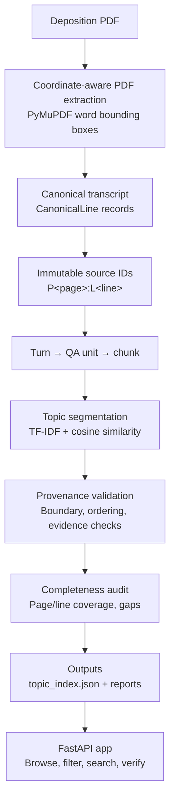

# DepoIndex

**AI-assisted deposition topic index with deterministic, page/line-level provenance**

DepoIndex turns a deposition transcript PDF into a chronological topic index where every entry cites an exact `P<page>:L<line>` location in the source document. An attorney (or reviewer) can check any claim against the original transcript in seconds — no re-reading the whole deposition, no trusting an AI summary on faith.

Built for **Problem #3 — AI/LLM Engineer Internship Problem-Solving Round**. Run end-to-end against the *Persis Yu* deposition (*Heather Turrey v. Vervent, Inc.*), a 122-page PDF with 82 pages of substantive testimony.

**Live Demo:** https://depoindex-yqim.onrender.com

**Repository:** [github.com/ddikshamitraa25/DepoIndex](https://github.com/ddikshamitraa25/DepoIndex)

**Author:** Diksha Mitra — VIT Bhopal University, B.Tech CSE (Core), 2024–2028

[GitHub](https://github.com/ddikshamitraa25) · [LinkedIn](https://www.linkedin.com/in/diksha-mitra-491929365/)

---

## Why DepoIndex?

The hard part of this problem isn't summarizing a deposition — an LLM can do that trivially, and badly, by hallucinating page numbers or paraphrasing testimony no one can check. The hard part is producing an index whose claims stay **verifiable against the source**, run after run.

DepoIndex is built around four properties:

- **Source-grounded output** — every topic's citations trace back to real, immutable transcript lines created once at extraction time.
- **Auditability** — a dedicated provenance validator checks every generated boundary before it reaches the final index; unverifiable topics don't survive.
- **Determinism** — no randomness in the default path, so the same PDF produces the same index every time.
- **Attorney verification** — citations use the same page/line format a court reporter's transcript already uses, and a `/api/provenance/check` endpoint re-verifies any entry on demand.

## Key Features

- **Coordinate-aware PDF extraction** — line numbers, speakers, and timestamps read from PyMuPDF word bounding boxes, not guessed from raw text layout
- **Deterministic topic segmentation** — TF-IDF + cosine similarity over Q&A structure, no LLM required by default
- **Exact page/line provenance** — every topic cites real `P<page>:L<line>` locations
- **Active provenance validation** — a validator gate rejects any topic whose boundaries or evidence can't be verified against the canonical transcript
- **Completeness / silent-gap detection** — an independent audit confirms no testimony page, line, or duplicate assignment was dropped
- **Continuation vs. re-entry handling** — page-distance caps and keyphrase fingerprinting distinguish an ongoing topic from a later return to the same subject
- **3-run deterministic stability** — bit-identical outputs (SHA-256-verified) across repeated runs
- **FastAPI attorney-facing UI** — browse, filter, and search the index, with a live provenance-check endpoint
- **Semantic topic search** — TF-IDF-based natural-language search over generated topics (bonus feature)
- **JSON + Markdown outputs** — machine-readable and human-readable index formats

## Tech Stack

| Layer | Technology |
|---|---|
| PDF extraction | PyMuPDF (word-level bounding boxes) |
| Topic segmentation | scikit-learn `TfidfVectorizer`, cosine similarity |
| Optional LLM assist (off by default) | OpenAI or Ollama, `temperature=0`, boundary-labeling only |
| Backend / API | FastAPI, Uvicorn |
| Frontend | Vanilla HTML/JS/CSS (static, served by FastAPI) |
| Config | `python-dotenv` |
| Testing | `pytest` |

No embeddings, vector database, or OCR are used — extraction is coordinate-based (not OCR), and search/segmentation run on TF-IDF, not learned embeddings.

## Results at a Glance

All figures are read directly from committed files in `outputs/` and `validation/` — not from a re-run performed while writing this document.

| Metric | Value |
|---|---|
| Total PDF pages | 122 |
| Testimony page range | P7 – P88 |
| Testimony lines | 2,042 |
| Chunks | 43 |
| Topics generated | 29 |
| Completeness gaps | 0 |
| Duplicate line assignments | 0 |
| Invalid provenance references | 0 |
| Manually reviewed topics | 25 of 29 |
| Location accuracy (computed) | 100% |
| Stability across 3 runs | Bit-identical (SHA-256-verified) |

---

## Architecture



Each stage only passes forward data it can prove came from the source transcript — the segmenter never invents a page or line number; it only groups pre-existing `CanonicalLine` objects.

## Extraction & Canonical Transcript

Extraction (`src/extraction/pdf_extract.py`) uses PyMuPDF's `page.get_text("words")`, which returns each word with its bounding box:

- Words are bucketed into visual rows; text left of `x0 = 95.0` is treated as the printed line-number column, text to the right is the line body.
- The transcript's own page number is recovered from a `Page N` footer independently of the PDF's physical page index — necessary because the word-index appendix restarts its own "Page 1" footer.
- Each page is classified into a **role** (transcript, index, word index, procedural appendix, certificate pages, etc.), so non-testimony pages are excluded from the testimony line count rather than merged into it.
- The testimony range (`P7–P88`) is detected from the first `Q` turn and the closing "deposition concluded" markers, not hardcoded.

Every line becomes a `CanonicalLine` with a `source_id` (`P<page>:L<line>`), assigned once at extraction and never regenerated downstream.

## Provenance

The citation format — `P7:L12`, or `P7:L1 – P9:L18` for a span — matches the coordinate system a court reporter's transcript already uses. An attorney can open the PDF to that page, count to that line, and see exactly what's cited. There's no translation layer between "what the system says" and "what's on the page."

Provenance is **enforced**, not asserted, by `ProvenanceValidator.validate_topic()` — the active gate in `src/segmentation/topics.py`. It rejects any candidate topic whose start or end doesn't exist, whose start is after its end, whose `source_id` is unknown, or whose evidence text doesn't overlap the actual transcript span at that location. Rejected topics are dropped before they ever reach the output; a boundary-clamping recovery path also exists in `src/provenance/validator.py` but isn't invoked by the current pipeline, since all candidate boundaries are built directly from real transcript lines.

This guarantees **source-reference validity**, not legal correctness — the system confirms a citation points to real, existing testimony text, not that the testimony means what a party claims it means.

In the committed run, all 29 topics pass validation on the first pass with zero clamping and zero drops (`tests/test_committed_outputs.py`).

## Topic Segmentation

Segmentation (`src/segmentation/topics.py`) works over structured Q&A units rather than asking an LLM to summarize the transcript into topics:

1. Lines are grouped into **Turns** (consecutive lines, same speaker), then **QA Units** (roughly one question-and-answer exchange), then **Chunks** (~1,800 characters or 6 units, whichever comes first).
2. A TF-IDF vectorizer is fit over the substantive (non-procedural) text of each chunk.
3. Chunks are walked in order and compared by cosine similarity to the running centroid of the current topic. Similarity at or above `CONTINUE_SIM = 0.18` (and under the `MAX_PAGES_CONTINUE = 8` page cap) continues the current topic; otherwise the topic is flushed and a new one starts.
4. The page cap exists so a single subject can't silently swallow the whole deposition on shared vocabulary alone (see Failure Analysis, Case 3).
5. Small trailing groups (under 350 characters) are merged into the preceding topic; oversized groups (over 10 pages) are re-split at their weakest internal similarity point.
6. Procedural chunks (objections, off-the-record language, reporter/videographer speech) are folded into whichever topic is open rather than breaking it; a unit that's *entirely* procedural is labeled `is_procedural: true` and is filterable in the UI.
7. Labels come from the first substantive question in the group (with filler words and interrupted fragments stripped), supplemented with TF-IDF keyphrases when the question text is short or generic.

An optional LLM-assist path (`DEPOINDEX_LLM_PROVIDER=openai|ollama`) can additionally label chunks as `continue` / `new_topic` / `brief_digression` / `related_distinct` at `temperature=0`, with automatic fallback to the deterministic path on any failure. **It only labels pre-existing chunks — it never generates or moves a page/line number.** The committed run used `DEPOINDEX_LLM_PROVIDER=none`, i.e. the deterministic path only.

**Why deterministic by default?** Coordinate-based extraction, fixed-vocabulary TF-IDF, and pure threshold comparisons involve no random seeds or sampling — the same input produces the same output every time, which matters more for a legal-adjacent tool than marginal gains from a non-deterministic model.

## Recurrence / Re-entry Handling

DepoIndex includes recurrence-aware topic handling to distinguish between a continuation of an existing discussion and a later return to a previously discussed subject.

The pipeline uses topic fingerprints, semantic similarity, and a minimum page-gap threshold (`RECURRENCE_GAP_PAGES = 4`) to identify meaningful re-entry while avoiding false matches from short-range continuation. A maximum topic-span constraint (`MAX_PAGES_CONTINUE`) also prevents distant discussions from being incorrectly merged into a single topic.

This approach is particularly important for deposition testimony, where related subjects may appear at multiple points in the examination. In the current deposition, discussions concerning the CFPB settlement and PEAKS-loan enforceability occur across multiple separated sections (T021, T028, and T029). The segmentation pipeline preserves these as distinct, chronologically addressable topics rather than incorrectly combining them into one long span.

Recurrence relationships are recorded through the `recurrence_of` and `related_topic_ids` fields when the implemented matching criteria identify a qualifying re-entry.

## Completeness Validation

`src/validation/completeness.py` runs a deterministic audit, not a spot-check: every testimony page in the detected range is checked for presence, missing line numbers are reported as gaps, duplicate printed line numbers are reported separately, and an independent re-derivation of the expected line range per page catches any silent skip the extractor's own bookkeeping missed.

Committed result: **zero gaps, zero duplicates** across all 2,042 testimony lines. A separate bucket of 160 `extraction_warnings` covers non-testimony front-matter and index pages and doesn't represent lost testimony content.

## Manual Validation

25 of 29 generated topics were manually reviewed (`validation/manual_validation_report.json`).

**Only location accuracy is a computed percentage.** Per the report's own methodology note, relevance, boundary quality, and coverage are qualitative reviewer labels, not independent automated measurements.

| Dimension | Result | Type |
|---|---|---|
| Location accuracy | 100% (25/25) | Computed |
| Topic relevance | All rated "High" | Qualitative |
| Boundary quality | Mostly "Good"; one flagged edge case (see below) | Qualitative |
| Coverage | 0 gaps / 0 duplicates across all 2,042 lines | Computed (via completeness audit) |
| Redundancy | Recorded "None" per entry | Qualitative |

The Markdown mirror of this report renders these qualitative labels as headline percentages (e.g. "Topic Relevance: 100.0%") for readability — this README reports them as reviewer judgments rather than independently computed metrics, consistent with the JSON source's own methodology note.

## Failure Analysis

Four real difficult cases, in full in `validation/failure_analysis.md`:

1. **"A" misread as a witness-answer marker.** A naive `^A\b` regex on raw text flipped speaker attribution on ordinary sentences starting with the letter A (e.g. "A couple other questions now."). Fixed by using word bounding-box columns to distinguish a genuine speaker cue from body text.
2. **Interrupted fragments producing useless topic titles.** A court-reporter parenthetical for overlapping speech produced a topic titled `"-- talking about?"`. Fixed by rejecting fragment-like or under-length turns when picking a label, falling back to the first substantive answer or a keyphrase.
3. **Non-contiguous recurrence vs. monolithic merging.** A subject re-examined three times, 19 pages apart, risked being merged into one 26-page topic on shared vocabulary. The page-span cap correctly split it into three chronological topics — but the cross-linking step that should have connected them didn't fire for this fingerprint overlap, which remains an open improvement.
4. **Off-the-record recesses with rapid speaker changes.** Splitting on every speaker change during a recess would create meaningless micro-topics. Procedural-text detection folds short procedural stretches into the enclosing substantive topic instead.

## Stability & Reproducibility

Three full pipeline runs (`scripts/compare_runs.py`, `DEPOINDEX_LLM_PROVIDER=none`) produced identical topic counts, labels, boundaries, source IDs, and extracted line counts — and matching SHA-256 checksums across all output artifacts.

**Scope of this claim:** bit-identical reproducibility is demonstrated for *this PDF*, on the *same runtime/environment*, in *deterministic mode*. It is not a claim of universal reproducibility across machines or PDFs, and it explicitly excludes the optional LLM-assisted path, which depends on an external API by nature even when clamped to `temperature=0`.

## Semantic Topic Search (Bonus)

DepoIndex includes a TF-IDF + cosine-similarity search over generated topic titles and evidence text, exposed via `/api/search`. It lets an attorney search by concept — without already knowing the exact topic label — and get ranked matches back.

This is separate from topic segmentation: search retrieves from an already-generated index, while the underlying topic boundaries and citations remain the deterministic, validated output described above.

## FastAPI Application

Served from `app/main.py` with a static vanilla HTML/JS/CSS front end.

| Endpoint | Method | Description |
|---|---|---|
| `/` | GET | Single-page UI |
| `/api/topics` | GET | All topics; supports `q` (text filter) and `procedural` params |
| `/api/topics/{topic_id}` | GET | One topic, its related topics, and source lines (if transcript available) |
| `/api/search` | GET | Semantic topic search (`q`, `k`) |
| `/api/completeness` | GET | Completeness report |
| `/api/validation` | GET | Manual validation report |
| `/api/provenance/check?topic_id=...` | GET | Live re-verification of one topic's citations |

The canonical transcript (`outputs/canonical_transcript.json`) is committed alongside the source deposition PDF used by the demo. This enables the deployed application to resolve source IDs back to the canonical transcript and perform live provenance verification.

For any topic, `/api/topics/{topic_id}` returns the corresponding source lines, while `/api/provenance/check?topic_id=...` independently re-verifies the topic's boundaries, source IDs, and line references against the canonical transcript.

## Limitations

- The repository includes the source deposition PDF and canonical transcript used by the current demo; the workflow is therefore reproducible against the committed source material.
- Recurrence-aware topic handling is implemented through topic fingerprinting, similarity thresholds, and page-gap constraints; recurrence relationships depend on the configured matching criteria.
- Segmentation thresholds were tuned empirically against this transcript's tight Q&A cadence; a transcript with long uninterrupted monologues would likely need different tuning.
- Single-witness, single-document design — no cross-deposition index or multi-witness handling.
- The optional LLM-assist path exists but wasn't exercised in the committed run.
- Manual validation covered 25 of 29 topics, and only location accuracy is a hard-computed metric (see Manual Validation).
- At larger scale (multiple depositions), the design would need a deposition-qualified source-ID namespace, a cross-deposition index rather than one JSON file per matter, and likely an embedding-based similarity step alongside TF-IDF, since vocabulary overlaps less tightly across different witnesses.

---

## Getting Started

### Install

```powershell
git clone https://github.com/ddikshamitraa25/DepoIndex.git
cd DepoIndex
python -m venv .venv
.venv\Scripts\Activate.ps1
pip install -r requirements.txt
copy .env.example .env
```

No API key is required for the default (deterministic) configuration.

### Configure

Key variables in `.env` (see `.env.example` for the full list):

```
DEPOINDEX_LLM_PROVIDER=none      # openai | ollama | none — deterministic by default
DEPOINDEX_PDF_PATH=data/Persis_Yu_Deposition.pdf
DEPOINDEX_TEMPERATURE=0
```

### Run the pipeline

The repository includes the source PDF used for the current run at `data/Persis_Yu_Deposition.pdf`.

To reproduce the pipeline from the committed source:

```powershell
python run_pipeline.py
```

This writes `outputs/canonical_transcript.json`, `chunks.json`, `topic_index.json`, `topic_index.md`, `completeness_report.json`, and `run_summary.json`.

For the 3-run stability comparison:

```powershell
python run_pipeline.py --run-name run1
python run_pipeline.py --run-name run2
python run_pipeline.py --run-name run3
python scripts/compare_runs.py
```

### Run the web app

```powershell
uvicorn app.main:app --reload
```

Open `http://127.0.0.1:8000`.

The committed topic index, canonical transcript, and source PDF enable full topic browsing, source-line drill-down, and live provenance verification.

The deployed demo is available at:

https://depoindex-yqim.onrender.com


### Test & verify

```powershell
pytest -v                              # 26 passed with the source PDF present;
                                        # 13 pass without it (PDF-dependent tests skip)
python scripts/verify_outputs.py       # checks expected output files exist
python scripts/verify_provenance.py    # re-validates every topic's citations
python scripts/verify_completeness.py  # asserts no missing pages/lines
python scripts/compare_runs.py         # regenerates the stability report
```

## Project Structure

```
DepoIndex/
├── app/                    # FastAPI app + static frontend
├── data/                   # source deposition PDF used by the demo
├── outputs/                # topic_index.json/.md, completeness_report.json, etc.
├── runs/                   # gitignored — stability-comparison snapshots
├── scripts/                # verification, comparison, presentation generation
├── slides/                 # presentation deck + transcript
├── src/
│   ├── extraction/         # coordinate-aware PDF extraction, canonical models
│   ├── pipeline/           # pipeline runner, report writers
│   ├── provenance/         # source-ID formatting, ProvenanceValidator
│   ├── segmentation/       # chunking, TF-IDF topic segmentation, LLM assist
│   └── validation/         # completeness auditing
├── tests/                  # pytest suite
└── validation/             # manual validation + failure analysis reports
```

## Git History

The repository was developed incrementally through multiple meaningful commits rather than as a single final upload.

- **Final submission state:** `629ca87` — `Add Git history section to README`
- **Earlier meaningful commit:** `1420625` — `Finalize DepoIndex pipeline and validation`

The earlier commit contains the completed processing pipeline and validation work. Subsequent commits added the deposition source, canonical transcript, live-demo support, AI/LLM usage documentation, and final submission documentation.

The final submission state is represented by the latest pushed commit shown above.

## Presentation

`slides/DepoIndex_Presentation.pptx` (5-slide, 16:9 deck) and `slides/presentation_transcript.md` walk through the project narratively. This README and the committed JSON/test outputs remain the authoritative source for verified results.

